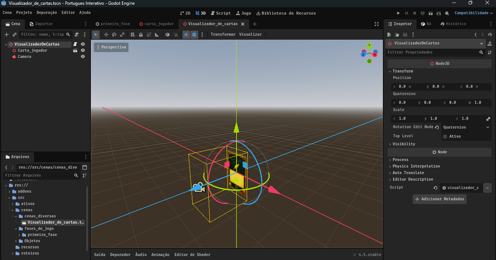
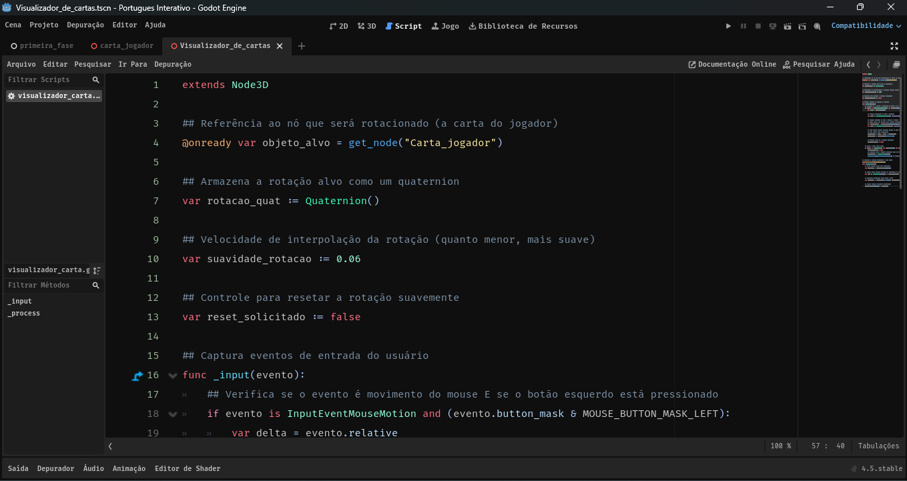

# Projeto Rotação por Quaternion
Uma demostração simples de como usar Quaternion para rotacionar objetos em projetos 3D na Godot Engine, usando uma carta para este exemplo.

## Índice
 - <a href="#layout">Layout</a>
 - <a href="#como-executar-este-projeto">Como executar este projeto?</a>
 - <a href="#tecnologias-utilizadas">Tecnologias</a>

## 📲Funcionalidades do projeto
 -[x] Usando a tecla "R" para resetar a rotação do objeto
 -[x] Clicar como o botão esquerdo do mouse e arrastar a carta
	  para rotacioná-la para todos os lados
	
## Layout




## Como executar este projeto?
```bash
# Clone este repositório
$ git clone https://github.com/JonasRdeveloper/Rotacionando-com-Quaternion.git

# Acesse a pasta do projeto no seu terminal
$ cd Rotacionando-com-Quaternion/

# Escanei o projeto com a Godot Engine e clique no botão editar... pronto!

```

## Tecnologias utilizadas
1. [Microsoft Designer](https://designer.microsoft.com/)
2. [Godot Engine](https://godotengine.org/)
